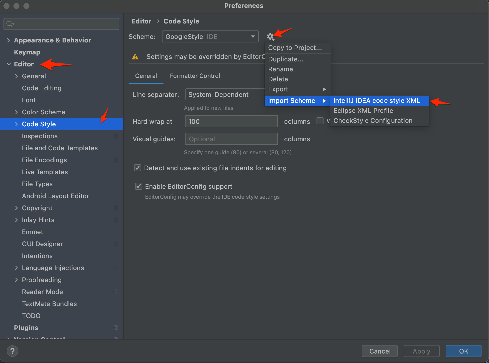

# Жека и 3 гнома - URL shortener {🧪}

## Students group

- Красношапка Євгеній ryorenzo12@gmail.com
- Капінус Артем kapinusartem.main@gmail.com
- Березовський Антон tohiix@gmail.com
- Давиденко Валерій vn.mechanic@gmail.com

## Design document

The [design document](https://docs.google.com/document/d/1fUpBESqRjYXvH0tiUt2d3xwbowTgnYpiwYEwDnzJfFc/edit?ts=602e9ad9) that
describes architecture and implementation details of this project.

### System structure

After the third laboratory assignment groups will switch projects with one another. Because of this,
all projects have to have the same high-level structure. Also, this is the reason why you should not
modify project dependencies.

Please remember that the main goal of the course is **testing** and everything else is just an 
implementation harness.

There are four modules:
- `auth` **authentication module** - creates new users, authenticates existing ones
- `bigtable` - **big table** - a key-value persistence storage (please, pay attention that you should implement it by
  yourself. It means that it is not allowed to use data bases, another key-value storages 
  implementation, etc)
- `logic` - **business logic** - logic of URL shortening
- `rest` - **REST API** - a module that provides a REST API. [Micronaut] framework is already added
  to project dependencies. It simplifies creation of REST API and provides built-in JWT 
  authentication.

## Environment prerequisites

### Java
This is a Java project, so you will need an environment with installed [JDK] 15. For installation, 
you could use:
- [sdkman] on Linux/MacOS 
- [AdoptOpenJDK] on Windows

### IDE  
As IDE use [IntelliJ Idea Edu].

### Checkstyle
We use [checkstyle] to ensure coding standards. To get real-time detection in IDE you could use [Checkstyle-IDEA] 
plugin. We use Google rules (local copy `./config/checkstyle/checkstyle.xml`).

## How to start development

1. Clone this repo
2. Open the project directory in IntelliJ Idea Edu
3. Configure IDE code style settings
  
    1. Open `Settings`
    2. Go to `Editor` -> `Code Style` -> `Import Scheme`
       
    3. Import scheme from `./config/idea/intellij-java-google-style.xml`
  
[JDK]: https://en.wikipedia.org/wiki/Java_Development_Kit
[IntelliJ Idea Edu]: https://www.jetbrains.com/idea-edu/
[sdkman]: https://sdkman.io/
[AdoptOpenJDK]: https://adoptopenjdk.net/
[7 rules of good commit messages]: https://chris.beams.io/posts/git-commit/#seven-rules
[Micronaut]: https://micronaut.io/
[checkstyle]: https://checkstyle.org/
[Checkstyle-IDEA]: https://plugins.jetbrains.com/plugin/1065-checkstyle-idea
